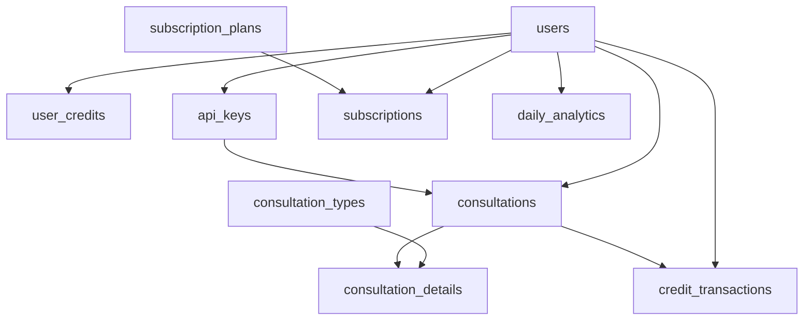

# 📊 Estrutura Completa do Banco de Dados - Valida SaaS

## 🎯 Visão Geral

**Banco de Dados**: Supabase PostgreSQL  
**URL**: `https://gbmlcmpclrivmyyfcdvi.supabase.co`  
**Total de Tabelas**: 10 tabelas ativas  
**Sistema**: SaaS de Consultas CNPJ com Sistema de Créditos  
**Última Análise**: 18/09/2025 09:14:30

---

## 📋 Resumo das Tabelas

| Tabela | Registros | Propósito | Status |
|--------|-----------|-----------|--------|
| `users` | 7 | Gestão de usuários do sistema | ✅ Ativo |
| `user_credits` | 2 | Sistema de créditos por usuário | ✅ Ativo |
| `subscription_plans` | 3 | Planos de assinatura disponíveis | ✅ Ativo |
| `subscriptions` | 2 | Assinaturas ativas dos usuários | ✅ Ativo |
| `api_keys` | 10 | Chaves de API dos usuários | ✅ Ativo |
| `consultation_types` | 6 | Tipos de consulta com custos | ✅ Ativo |
| `consultations` | 1 | Histórico de consultas realizadas | ✅ Ativo |
| `consultation_details` | 1 | Detalhes por tipo de cada consulta | ✅ Ativo |
| `credit_transactions` | 2 | Transações de crédito | ✅ Ativo |
| `daily_analytics` | 1 | Analytics diário consolidado | ✅ Ativo |

---

## 🏗️ Esquemas Detalhados das Tabelas

### 1. 👤 **users** - Gestão de Usuários

**Propósito**: Tabela principal de usuários do sistema SaaS

```sql
CREATE TABLE users (
    id UUID PRIMARY KEY,                    -- Identificador único
    email VARCHAR(255) UNIQUE NOT NULL,     -- Email de login
    name VARCHAR(255) NOT NULL,             -- Nome completo
    password_hash VARCHAR(255),             -- Hash da senha
    last_login TIMESTAMP,                   -- Último login
    is_active BOOLEAN DEFAULT TRUE,         -- Status ativo
    created_at TIMESTAMP DEFAULT NOW(),     -- Data de criação
    updated_at TIMESTAMP DEFAULT NOW()      -- Última atualização
);
```

**Dados de Exemplo**:
- 7 usuários cadastrados
- Usuário dev: `dev@valida.com.br`
- Último login: 17/09/2025 16:16:56

**Relacionamentos**: 
- `user_credits.user_id` → `users.id`
- `api_keys.user_id` → `users.id`
- `subscriptions.user_id` → `users.id`

---

### 2. 💰 **user_credits** - Sistema de Créditos

**Propósito**: Controle de créditos por usuário com renovação automática

```sql
CREATE TABLE user_credits (
    id UUID PRIMARY KEY,                    -- ID único do registro
    user_id UUID REFERENCES users(id),     -- Referência ao usuário
    available_credits_cents INTEGER,       -- Créditos disponíveis (centavos)
    total_purchased_cents INTEGER,         -- Total de créditos comprados
    total_used_cents INTEGER,              -- Total de créditos usados
    last_auto_renewal TIMESTAMP,           -- Última renovação automática
    auto_renewal_count INTEGER DEFAULT 0,  -- Contador de renovações
    created_at TIMESTAMP DEFAULT NOW(),    -- Data de criação
    updated_at TIMESTAMP DEFAULT NOW()     -- Última atualização
);
```

**Sistema de Valores**:
- **Créditos iniciais**: R$ 10,00 (1000 centavos)
- **Renovação automática**: Habilitada por padrão
- **Controle preciso**: Valores em centavos para evitar problemas de arredondamento

**Dados Atuais**:
- 2 usuários com créditos configurados
- Saldo padrão: R$ 10,00 (1000 centavos)

---

### 3. 📦 **subscription_plans** - Planos de Assinatura

**Propósito**: Catálogo de planos disponíveis no SaaS

```sql
CREATE TABLE subscription_plans (
    id UUID PRIMARY KEY,                    -- ID único do plano
    code VARCHAR(50) UNIQUE,               -- Código do plano (basic, pro, enterprise)
    name VARCHAR(100) NOT NULL,            -- Nome do plano
    description TEXT,                      -- Descrição detalhada
    price_cents INTEGER NOT NULL,         -- Preço em centavos
    credits_included_cents INTEGER,       -- Créditos inclusos
    api_keys_limit INTEGER DEFAULT 1,     -- Limite de chaves API
    auto_renew_on_depletion BOOLEAN,      -- Renovação automática
    is_active BOOLEAN DEFAULT TRUE,       -- Plano ativo
    created_at TIMESTAMP DEFAULT NOW(),   -- Data de criação
    updated_at TIMESTAMP DEFAULT NOW()    -- Última atualização
);
```

**Planos Disponíveis**:

| Código | Nome | Preço | Créditos | API Keys | Renovação |
|--------|------|-------|----------|----------|-----------|
| `basic` | Plano Básico | R$ 100,00 | R$ 100,00 | 1 | ✅ |
| `professional` | Plano Profissional | R$ 300,00 | R$ 300,00 | 5 | ✅ |
| `enterprise` | Plano Empresarial | R$ 500,00 | R$ 500,00 | 10 | ✅ |

---

### 4. 🔐 **api_keys** - Chaves de API

**Propósito**: Gerenciamento de chaves de API por usuário

```sql
CREATE TABLE api_keys (
    id UUID PRIMARY KEY,                    -- ID único da chave
    user_id UUID REFERENCES users(id),     -- Proprietário da chave
    key_hash VARCHAR(255) NOT NULL,        -- Hash da chave (segurança)
    name VARCHAR(100) NOT NULL,            -- Nome da chave
    is_active BOOLEAN DEFAULT TRUE,        -- Status ativo
    last_used_at TIMESTAMP,               -- Último uso
    daily_queries INTEGER DEFAULT 0,       -- Queries do dia atual
    daily_cost_cents INTEGER DEFAULT 0,    -- Custo diário
    created_at TIMESTAMP DEFAULT NOW(),    -- Data de criação
    updated_at TIMESTAMP DEFAULT NOW()     -- Última atualização
);
```

**Dados Atuais**:
- 10 chaves API cadastradas
- Sistema de hash para segurança
- Controle de uso diário por chave

---

### 5. 🏷️ **consultation_types** - Tipos de Consulta

**Propósito**: Catálogo de tipos de consulta disponíveis com seus custos

```sql
CREATE TABLE consultation_types (
    id UUID PRIMARY KEY,                    -- ID único do tipo
    code VARCHAR(50) UNIQUE NOT NULL,      -- Código do tipo
    name VARCHAR(100) NOT NULL,            -- Nome do tipo
    description TEXT,                      -- Descrição
    cost_cents INTEGER NOT NULL,          -- Custo em centavos
    provider VARCHAR(50) NOT NULL,        -- Provedor (resolve_cenprot, cnpja)
    is_active BOOLEAN DEFAULT TRUE,       -- Tipo ativo
    created_at TIMESTAMP DEFAULT NOW(),   -- Data de criação
    updated_at TIMESTAMP DEFAULT NOW()    -- Última atualização
);
```

**Tipos Disponíveis**:

| Código | Nome | Custo | Provedor | Descrição |
|--------|------|-------|----------|-----------|
| `protestos` | Consulta de Protestos | R$ 0,15 | resolve_cenprot | Consulta protestos via Resolve CenProt |
| `receita_federal` | Receita Federal | R$ 0,05 | cnpja | Dados básicos da empresa |
| `simples_nacional` | Simples Nacional | R$ 0,05 | cnpja | Regime tributário |
| `cadastro_contribuintes` | Cadastro de Contribuintes | R$ 0,05 | cnpja | Inscrições estaduais |
| `geocodificacao` | Geocodificação | R$ 0,05 | cnpja | Coordenadas geográficas |
| `suframa` | Suframa | R$ 0,05 | cnpja | Dados da Suframa |

---

### 6. 📋 **consultations** - Histórico de Consultas

**Propósito**: Registro principal de todas as consultas realizadas

```sql
CREATE TABLE consultations (
    id UUID PRIMARY KEY,                    -- ID único da consulta
    user_id UUID REFERENCES users(id),     -- Usuário que fez a consulta
    api_key_id UUID REFERENCES api_keys(id), -- Chave API utilizada
    cnpj VARCHAR(18) NOT NULL,             -- CNPJ consultado
    status VARCHAR(20) DEFAULT 'success',  -- Status (success, error, partial)
    total_cost_cents INTEGER DEFAULT 0,   -- Custo total da consulta
    response_time_ms INTEGER,             -- Tempo de resposta
    cache_used BOOLEAN DEFAULT FALSE,     -- Se usou cache
    error_message TEXT,                   -- Mensagem de erro (se houver)
    created_at TIMESTAMP DEFAULT NOW()    -- Data da consulta
);
```

**Métricas**:
- 1 consulta registrada no sistema
- Controle de performance (response_time_ms)
- Sistema de cache implementado

---

### 7. 📊 **consultation_details** - Detalhes por Tipo

**Propósito**: Detalhamento de cada tipo de consulta realizada

```sql
CREATE TABLE consultation_details (
    id UUID PRIMARY KEY,                             -- ID único do detalhe
    consultation_id UUID REFERENCES consultations(id), -- Consulta pai
    consultation_type_id UUID REFERENCES consultation_types(id), -- Tipo consultado
    success BOOLEAN NOT NULL DEFAULT TRUE,          -- Sucesso do tipo específico
    cost_cents INTEGER NOT NULL,                    -- Custo específico
    response_data JSONB,                           -- Dados retornados
    cache_used BOOLEAN DEFAULT FALSE,              -- Cache usado neste tipo
    response_time_ms INTEGER,                      -- Tempo específico
    error_message TEXT,                            -- Erro específico
    created_at TIMESTAMP DEFAULT NOW()             -- Data do detalhe
);
```

**Funcionalidade**:
- Permite consultas multi-tipo (ex: Protestos + Receita Federal)
- Controle granular de custos por tipo
- Dados JSONB para flexibilidade de resposta

---

### 8. 💳 **credit_transactions** - Transações de Crédito

**Propósito**: Histórico completo de todas as transações de crédito

```sql
CREATE TABLE credit_transactions (
    id UUID PRIMARY KEY,                    -- ID único da transação
    user_id UUID REFERENCES users(id),     -- Usuário da transação
    transaction_type VARCHAR(50),          -- Tipo (purchase, usage, refund, renewal)
    amount_cents INTEGER NOT NULL,        -- Valor da transação
    description TEXT,                     -- Descrição da transação
    consultation_id UUID,                 -- Consulta relacionada (se aplicável)
    balance_after_cents INTEGER,         -- Saldo após transação
    created_at TIMESTAMP DEFAULT NOW(),   -- Data da transação
    metadata JSONB                        -- Dados adicionais
);
```

**Tipos de Transação**:
- `purchase` - Compra de créditos
- `usage` - Uso em consultas
- `refund` - Estorno
- `renewal` - Renovação automática

---

### 9. 📈 **daily_analytics** - Analytics Diário

**Propósito**: Métricas consolidadas por dia para relatórios

```sql
CREATE TABLE daily_analytics (
    id UUID PRIMARY KEY,                    -- ID único do registro
    user_id UUID REFERENCES users(id),     -- Usuário das métricas
    date DATE NOT NULL,                    -- Data das métricas
    total_consultations INTEGER DEFAULT 0, -- Total de consultas
    successful_consultations INTEGER DEFAULT 0, -- Consultas bem-sucedidas
    failed_consultations INTEGER DEFAULT 0, -- Consultas com falha
    total_cost_cents INTEGER DEFAULT 0,   -- Custo total do dia
    protestos_count INTEGER DEFAULT 0,    -- Quantidade de consultas de protestos
    receita_count INTEGER DEFAULT 0,      -- Quantidade de consultas da receita
    avg_response_time_ms INTEGER,         -- Tempo médio de resposta
    cache_hit_rate DECIMAL(5,2),         -- Taxa de cache hits
    created_at TIMESTAMP DEFAULT NOW(),   -- Data de criação
    updated_at TIMESTAMP DEFAULT NOW()    -- Última atualização
);
```

**Métricas Disponíveis**:
- Performance: tempo de resposta, taxa de cache
- Uso: consultas por tipo, custos
- Qualidade: taxa de sucesso/falha

---

### 10. 🏢 **subscriptions** - Assinaturas Ativas

**Propósito**: Controle das assinaturas ativas dos usuários

```sql
CREATE TABLE subscriptions (
    id UUID PRIMARY KEY,                    -- ID único da assinatura
    user_id UUID REFERENCES users(id),     -- Usuário da assinatura
    plan_id UUID REFERENCES subscription_plans(id), -- Plano assinado
    status VARCHAR(20) DEFAULT 'active',   -- Status da assinatura
    stripe_subscription_id VARCHAR(255),   -- ID no Stripe
    current_period_start TIMESTAMP,       -- Início do período atual
    current_period_end TIMESTAMP,         -- Fim do período atual
    auto_renew BOOLEAN DEFAULT TRUE,       -- Renovação automática
    created_at TIMESTAMP DEFAULT NOW(),   -- Data de criação
    updated_at TIMESTAMP DEFAULT NOW()    -- Última atualização
);
```

**Integração**:
- Conectado ao Stripe para pagamentos
- Controle de períodos de cobrança
- Sistema de renovação automática

---

## 🔗 Relacionamentos Entre Tabelas



### 🎯 Relacionamentos Críticos:

1. **users** é o centro do sistema - todas as outras tabelas referenciam usuários
2. **consultations** → **consultation_details** (1:N) - Uma consulta pode ter múltiplos tipos
3. **consultation_types** define custos → usado em **consultation_details**
4. **credit_transactions** registra cada movimentação de crédito
5. **daily_analytics** agrega dados para relatórios de performance

---

## 💡 Padrões e Convenções

### 🏷️ **Nomenclatura**:
- `id` - Sempre UUID como chave primária
- `user_id` - Referência para usuários
- `*_at` - Campos de timestamp
- `*_cents` - Valores monetários em centavos
- `is_*` - Campos boolean

### 💰 **Sistema de Créditos**:
- **Todos os valores em centavos** para precisão
- **R$ 1,00 = 100 centavos**
- **Protestos**: 15 centavos (R$ 0,15)
- **Outros tipos**: 5 centavos (R$ 0,05)

### 🔄 **Sistema de Renovação**:
- Renovação automática quando créditos < custo da consulta
- Histórico completo em `credit_transactions`
- Contadores em `user_credits.auto_renewal_count`

---

## 📊 Status Atual do Banco

### ✅ **Dados Existentes**:
- **7 usuários** cadastrados
- **3 planos** de assinatura ativos
- **10 chaves API** criadas
- **6 tipos de consulta** configurados
- **Sistema de créditos** funcionando
- **Analytics** implementado

### 🎯 **Funcionalidades Ativas**:
- ✅ Cadastro e autenticação de usuários
- ✅ Sistema de créditos com renovação automática
- ✅ Múltiplos tipos de consulta com custos específicos
- ✅ Controle de API keys por usuário
- ✅ Histórico detalhado de consultas
- ✅ Analytics consolidado
- ✅ Integração com Stripe preparada

### 🔧 **Para Desenvolvimento de IA**:
- **Estrutura estável** e bem documentada
- **Dados reais** disponíveis para testes
- **APIs funcionais** para todos os serviços
- **Sistema de créditos** transparente e preciso
- **Relacionamentos claros** entre entidades

---

## 🚀 Próximos Passos para IA

1. **Usar esta documentação** como referência para queries
2. **Conectar serviços** aos endpoints do run.py
3. **Testar consultas** usando dados reais
4. **Implementar dashboards** com métricas reais
5. **Validar sistema de créditos** em funcionamento

---

**📋 Status**: Banco de dados COMPLETO e FUNCIONAL  
**📅 Última Atualização**: 18/09/2025  
**🔗 Conexão**: Supabase PostgreSQL  
**✅ Pronto para**: Integração com frontend e APIs
